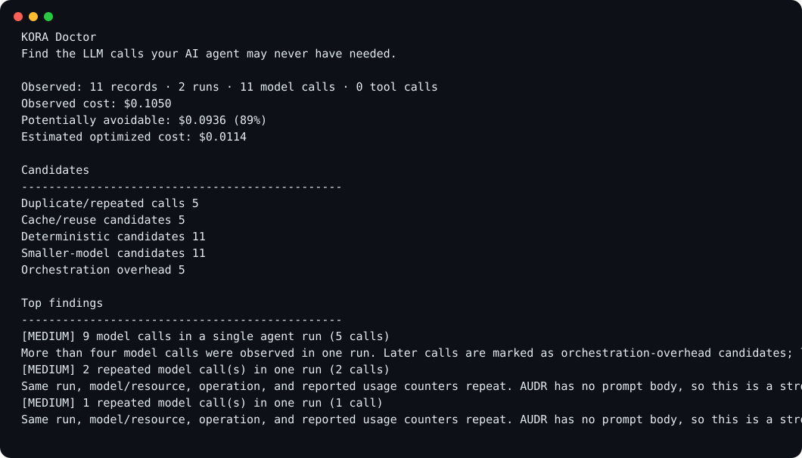

# KORA Doctor

**Find execution waste in AI agent runs.**

AUDR can tell you what an agent ran and what it cost. KORA Doctor asks the next question:

> **Which parts of that execution should disappear?**

KORA Doctor is a small open-source CLI that analyzes [AUDR](https://openaudr.dev/) JSON/JSONL and surfaces waste across tool usage, context growth, deterministic work, repeated inference, orchestration, and model choice.

No dashboard. No account. No hosted service.



## Quick start

Install directly from GitHub:

```bash
pipx install git+https://github.com/Krako-Labs/kora-doctor.git
```

Then audit an AUDR file:

```bash
kora-doctor audit audr.jsonl
```

From a clone:

```bash
python3 -m kora_doctor audit samples/inefficient_agent.jsonl
```

Machine-readable output:

```bash
kora-doctor audit audr.jsonl --json
```

With an OTel sidecar:

```bash
kora-doctor audit samples/otel_audr.jsonl --otel samples/otel_sidecar.json
```

## Example

The v0.1.1 harness sample is synthetic and exists to exercise the heuristics. It is not a benchmark.

```text
KORA Doctor
Find execution waste in AI agent runs.

Observed: 7 records · 1 runs · 5 model calls · 2 tool calls
Observed cost:                      $0.0660
Potentially avoidable:              $0.0130  (20%)
Estimated optimized cost:           $0.0530

Execution waste candidates
-----------------------------------------------
Repeated tool/read calls           1
Context amplification              2
Deterministic candidates           1
Repeated model calls               0
Cross-run reuse candidates         0
Orchestration overhead             0
Smaller-model candidates           2
```

Run it:

```bash
kora-doctor audit samples/harness_waste.jsonl
```

## What it looks for

KORA Doctor now prioritizes execution waste before model downsizing:

- **Repeated tool/read calls** — the same AUDR tool/resource and operation repeating inside one run.
- **Context amplification** — input-token growth that can indicate carried retrieval results, growing context, or repeated static tool definitions.
- **Prompt cache efficiency** — observed cache-read share from AUDR cache counters, surfaced without assuming one universal 'good' threshold.
- **Deterministic validation** — validation/schema/format work that may belong in JSON Schema, parsing, or ordinary code instead of an LLM.
- **Repeated inference** — model/resource and usage signatures repeating inside a run.
- **Cross-run reuse candidates** — similar signatures appearing across multiple runs.
- **Suspicious orchestration overhead** — long model-call chains that deserve inspection.
- **Smaller-model candidates** — considered after execution waste is removed.

**Fix execution waste first. Downsize models second.**

The goal is to narrow a trace down to the execution steps a developer should inspect first.

## Why the output says “candidate”

AUDR v1.0.0 deliberately records usage/cost telemetry without prompt content or secrets. That is good for security, but it also means an AUDR record alone usually cannot prove that two model calls were semantically identical or that a task could definitely have been deterministic.

KORA Doctor therefore uses:

- **observed** for values directly present in the trace
- **estimated** for derived savings
- **candidate** for optimization opportunities
- **confidence** for heuristic strength
- **insufficient evidence** where the trace cannot support a stronger conclusion

Savings are only calculated when `cost.total_cost` is present. Multiple currencies are never silently converted.

### Current savings assumptions

The dollar estimate is a scenario estimate attached to each candidate, not a measured future bill:

- repeated tool/read candidate: not included in savings without stronger request/freshness evidence
- context amplification candidate: not included in savings without payload evidence
- duplicate/repeated model call: 100% of that call's observed cost
- cache/reuse candidate: 70%
- deterministic candidate: 80–90% depending on evidence
- orchestration-overhead candidate: 50%
- smaller-model candidate: 50%

If one call matches several rules, KORA Doctor uses only the largest ratio for that call; it never stacks savings estimates. These defaults are intentionally easy to inspect and change as real traces arrive.

## Optional tool fingerprints

AUDR intentionally avoids raw tool arguments and results. KORA Doctor can still use privacy-preserving fingerprints when a trace source places hashes in `attribution.labels`:

```json
{
  "attribution": {
    "labels": {
      "tool_args_hash": "sha256:...",
      "tool_result_hash": "sha256:..."
    }
  }
}
```

When the same tool repeats in one run:

- same tool, no fingerprint -> low-confidence repeat candidate
- same tool + same `tool_args_hash` -> medium-confidence same-argument repeat
- same tool + same args hash + same `tool_result_hash` -> medium-confidence exact repeated-work evidence
- same tool + different argument hashes -> **not** treated as a duplicate

KORA Doctor never needs the raw tool payload for this check, and fingerprint-based findings still do not claim guaranteed savings because freshness and safety checks can make a repeat legitimate.

## OTel sidecar enrichment

KORA Doctor can combine portable AUDR cost/usage records with richer OpenTelemetry execution evidence:

```bash
kora-doctor audit audr.jsonl --otel trace.json
```

The sidecar accepts standard OTLP JSON `resourceSpans -> scopeSpans -> spans` as well as simpler JSON span arrays.

When matching spans are found by `span_id` / `trace_id`, KORA Doctor can enrich the AUDR record with:

- SHA-256 fingerprints of `gen_ai.tool.call.arguments`
- SHA-256 fingerprints of `gen_ai.tool.call.result`
- OTel span status as per-operation status
- optional retry / consumption / planning attributes when present
- inferred retry lineage when the same hashed tool call follows an explicit failed/timeout/unknown span

Raw tool arguments and results are hashed in memory and are not copied into the KORA Doctor report.

This keeps AUDR as the portable usage/cost layer while letting OTel/traceAI provide stronger execution evidence.

## Optional dead-work evidence

KORA Doctor does not infer unused outputs from timing alone. Richer trace sources can provide explicit downstream-consumption evidence:

```json
{
  "attribution": {
    "labels": {
      "output_consumed": "false",
      "step_role": "planner",
      "planned_step_count": "5",
      "executed_step_count": "2"
    }
  }
}
```

This enables two conservative findings:

- outputs explicitly marked as unconsumed
- planners that explicitly report more planned steps than executed steps

These findings stay out of savings estimates until a real replay/evaluation proves the work can be removed safely.

## Optional retry lineage

AUDR v1.0.0 has run-level errors and outcomes, but not per-operation retry lineage. Richer trace sources can preserve retry evidence in `attribution.labels`:

```json
{
  "attribution": {
    "labels": {
      "tool_args_hash": "sha256:...",
      "retry_of": "01KD...",
      "retry_attempt": "2",
      "operation_status": "timeout"
    }
  }
}
```

KORA Doctor resolves `retry_of` against either a prior `record_id` or `span_id`. Confidence increases when retry lineage, matching argument fingerprints, and prior per-operation status all agree.

A retry is reported as overhead evidence, not automatically as removable waste. Timeouts, idempotency, and unknown remote outcomes can make a retry necessary.

## Prompt cache metrics

When AUDR records include prompt-cache counters, KORA Doctor reports observed reuse directly:

```text
Prompt cache reuse: 0%  (0 read / 9,600 uncached; 3 calls)
```

`usage.llm.input_tokens` in AUDR v1.0.0 is uncached input and excludes cache reads. KORA Doctor therefore calculates cache-read share from `input_tokens + cache_read_tokens`.

It does **not** hard-code a universal cache-hit target. A low reuse rate becomes more interesting when the same run also shows persistent high context or context amplification.

## AUDR compatibility

KORA Doctor currently targets **AUDR v1.0.0** and accepts:

- one AUDR JSON object
- a JSON array of AUDR objects
- JSONL with one AUDR object per line

It checks the core fields needed for analysis, but it is **not** a replacement for the official AUDR JSON Schema conformance validator.

AUDR upstream currently provides adapters for LiteLLM, Vercel AI SDK, Mastra, NVIDIA NeMo Relay, and Merge Gateway, plus sinks including Chargebee.

## Samples

```bash
python3 -m kora_doctor audit samples/simple.jsonl
python3 -m kora_doctor audit samples/multi_step.jsonl
python3 -m kora_doctor audit samples/inefficient_agent.jsonl
python3 -m kora_doctor audit samples/harness_waste.jsonl
python3 -m kora_doctor audit samples/cache_instability.jsonl
python3 -m kora_doctor audit samples/tool_fingerprints.jsonl
python3 -m kora_doctor audit samples/retry_lineage.jsonl
python3 -m kora_doctor audit samples/unused_work.jsonl
```

The samples are synthetic AUDR-compatible traces created for KORA Doctor. The inefficient trace is intentionally constructed to trigger multiple heuristics.

## Local development

KORA Doctor has no runtime dependencies.

```bash
python3 -m venv .venv
source .venv/bin/activate
python3 -m pip install -e .
python3 -m unittest discover -s tests -v
./scripts/demo.sh
```

## Limitations

- AUDR v1.0.0 does not include normalized tool arguments or prompt bodies, so repeated tool/read and duplicate-model findings remain candidates.
- Context amplification can be observed from token growth, but AUDR alone cannot identify the exact carried payload.
- Prompt-cache metrics are only available when the adapter/provider reports `cache_read_tokens` / `cache_write_tokens`; KORA Doctor does not assume that missing cache telemetry means zero reuse.
- Deterministic candidates are inferred from run names, labels, and reported usage only.
- Smaller-model recommendations do not benchmark output quality.
- Estimated savings are scenario estimates, not guaranteed savings.
- KORA Doctor does not modify your agent or automatically reroute traffic in v0.

These are deliberate v0 constraints. If real traces show that an extra signal is necessary, we will add the smallest useful one.

## Relationship to KORA

KORA Doctor is standalone. It does **not** require the full KORA runtime.

Today:

```text
AUDR trace -> KORA Doctor -> diagnose
```

If users pull for it later:

```text
AUDR trace -> diagnose -> recommend -> optimize automatically with KORA
```

## Contributing

Real AUDR traces, false positives, and missed optimization opportunities are the highest-value feedback.

See [CONTRIBUTING.md](CONTRIBUTING.md) or open an issue.

## License

Apache-2.0.


### Conditional consumers and unused output

Optional AUDR `attribution.labels` (also accepted from matching OTel span attributes):
`output_consumed=false`, `conditional_consumer_exists=true`, and
`no_downstream_consumer=true`. These distinguish output not consumed **in the
observed run** from a dormant fallback/approval/error path and an explicitly
reported absence of any downstream consumer. Without the last signal, unused
output remains a low-confidence candidate, **not proven dead work**. These
findings never contribute to estimated savings. Example:

```bash
kora-doctor audit samples/conditional_consumers.jsonl
```


### Re-planning loop candidates (explicit evidence only)

To inspect planning unchanged after a non-empty tool result, attach stable digests
of **action lists**, never prose or raw payloads, as `attribution.labels`:
`plan_before_hash`, `plan_after_hash`, `next_action_before_hash`,
`next_action_after_hash`, `nonempty_result=true`, and `expected_repeat=false`.
The last label must be supplied by the instrumented runtime; when unknown or
true, KORA Doctor does not flag an intentional polling/retry-with-backoff loop.
These are candidates, not validated waste or cost savings.

```bash
kora-doctor audit samples/replanning_loops.jsonl
```
